  

<h1 align="center">LedgerSync 📊</h1>
<h3 align="center">Your Intelligent LedgerSync Trading Assistant</h3>

  Features •
  Demo •
  Install •
  Roadmap •
  Support

  
  
  
  

---

## 🚀 **Why LedgerSync?**
**Turn Historical Data into Trading Wisdom**  
我们为加密货币交易者提供一站式历史数据分析解决方案：
- 🔍 **深度复盘**: 精确回测1年以上交易数据，支持自定义滑点/手续费
- 📥 **一键报告**: 导出专业级PDF报告，含动态图表与策略总结模板
- 🌐 **多平台覆盖**: Windows版已上线，移动端（iOS/Android）即将推出

---

## ✨ **Features Preview**
| 功能模块        | 技术亮点                          | 可视化示例                     |
|-----------------|-----------------------------------|--------------------------------|
| **数据清洗**    | 自动排除交易所异常数据（如刷量）  |  |
| **策略回测**    | 支持C#脚本扩展自定义指标      |  |
| **跨平台同步**  | 端到端加密同步交易日志            |   |

---

## 🛠 **Tech Stack**

```mermaid
graph LR
  A[数据层] --> B[交易所API]
  A --> C[本地数据库]
  D[分析引擎] --> E[回测模块]
  G[前端] --> H[Windows WPF]
  G --> I[移动端 MAUI]
```

## ❤️ Support Me
If you find this project helpful, consider supporting me via crypto:
 
- **Ethereum (ETH)**: `0x9D9022767D72Faf829E0015A9b0c288C5901DC8C`  
- **Ltccoin (LTC)**: `LYmte1G1sHyEm66mdCkXpZzuRaLjNoGspe`  
- **Avalanche (AVAX)**: `0x9D9022767D72Faf829E0015A9b0c288C5901DC8C`  
    

